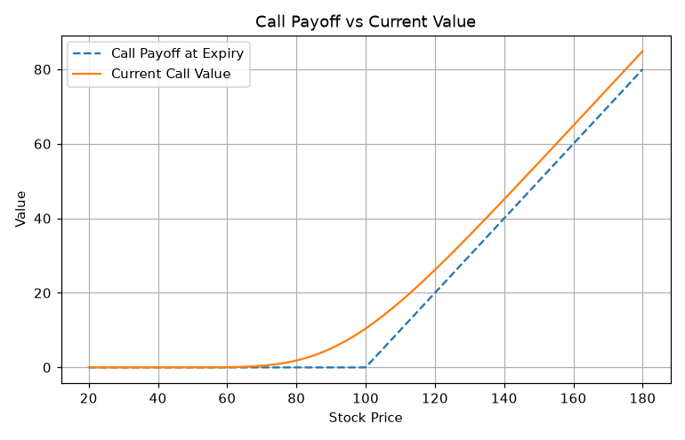
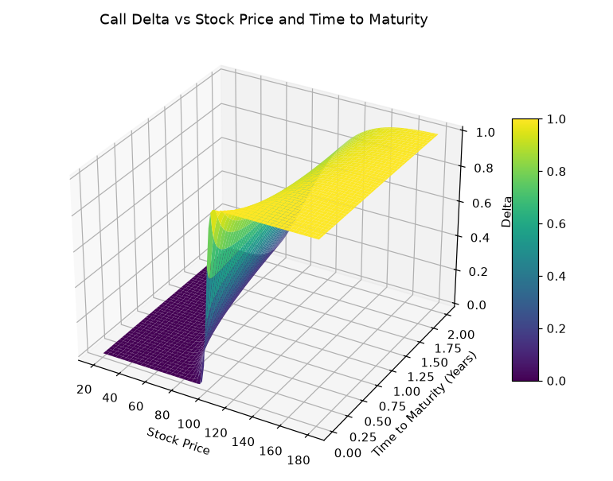
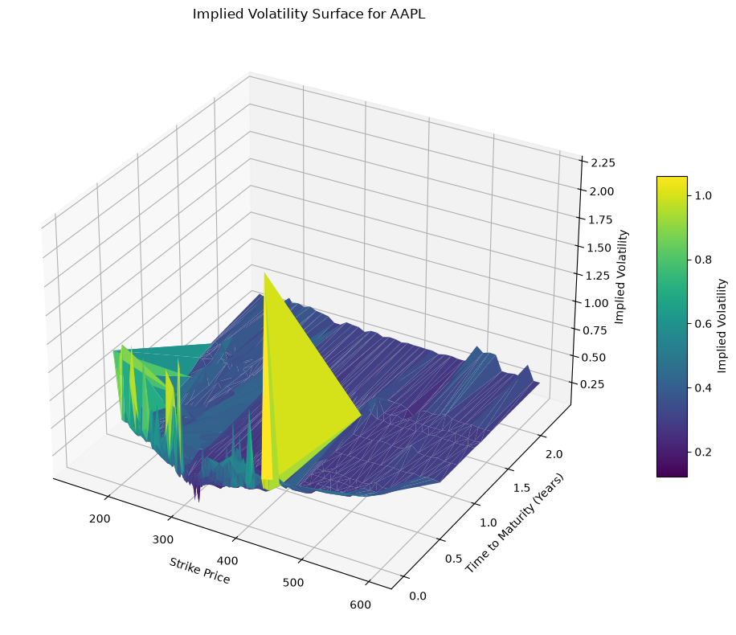

# Options Pricing Lab

[](https://github.com/camm999/options-pricing-lab/actions/workflows/tests.yml)

A from-scratch options pricing toolkit: Black-Scholes pricing, all five Greeks (analytical and
finite-difference), Monte Carlo simulation, and a Newton-Raphson implied volatility solver — applied
first to theoretical examples, then to live option chains pulled from Yahoo Finance to build real
volatility smiles and surfaces.

<p align="center">
  
  
  
</p>

## What's here

- **`src/optionspricing/`** — the pricing engine, as a reusable, tested Python package rather than
  code duplicated across notebooks:
  - `black_scholes.py` — European call/put pricing with a continuous dividend yield.
  - `greeks.py` — delta, gamma, vega, theta, rho, both analytically and via central finite
    differences, so the two can be cross-checked against each other.
  - `monte_carlo.py` — GBM path simulation and Monte Carlo option pricing.
  - `implied_vol.py` — Newton-Raphson implied volatility solver, using `vega` as the derivative.
  - `market_data.py` — OCC option ticker parsing (regex-based) and live data fetching via
    `yfinance`: underlying price, dividend yield, a risk-free rate proxy (`^IRX`), and full option
    chains for building smiles and surfaces.
- **`notebooks/`** — four notebooks that walk through the theory and then apply it to real data,
  importing from `src/optionspricing` rather than redefining functions inline:
  1. `01_black_scholes_and_payoffs.ipynb` — pricing formulas, payoff vs. current-value analysis.
  2. `02_greeks.ipynb` — all five Greeks, 2D/3D sensitivity plots, and a numerical cross-check.
  3. `03_monte_carlo_and_implied_vol.ipynb` — GBM simulation, Monte Carlo convergence, and the
     Newton-Raphson implied volatility solver.
  4. `04_real_market_implied_vol.ipynb` — a real volatility smile and surface built from a live
     option chain, using that same Newton-Raphson solver.
- **`tests/`** — a `pytest` suite: put-call parity, analytical-vs-finite-difference Greeks agreement,
  Monte Carlo convergence, and implied-volatility round-tripping.

## Install

```bash
pip install -r requirements.txt
```

## Run the tests

```bash
pytest
```

## Use the notebooks

```bash
jupyter notebook notebooks/
```

Notebook 4 needs internet access (it queries Yahoo Finance) and will prompt for an OCC-format option
ticker, e.g. `AAPL260320C00250000`.

## Use the package directly

```python
from optionspricing import black_scholes_call, delta_call, implied_volatility_newton

price = black_scholes_call(S=100, K=100, T=1, r=0.05, sigma=0.20)
delta = delta_call(S=100, K=100, T=1, r=0.05, sigma=0.20)
iv = implied_volatility_newton(market_price=10.45, S=100, K=100, T=1, r=0.05)
```

## Background: what Black-Scholes gets wrong

The theoretical notebooks each end with a "where this model breaks" section — the short version:

- **Volatility smile/skew** — real markets don't price a single flat volatility across strikes and
  maturities the way Black-Scholes assumes (see notebooks 3 and 4).
- **Near-expiry instability** — as time to expiry shrinks, gamma and vega spike and delta becomes a
  step function; continuous hedging becomes impossible.
- **Log-normal returns** — real returns have fat tails and negative skew; Black-Scholes underprices
  the probability of large moves.
- **Constant rates and no frictions** — real hedging has transaction costs, and rates aren't constant
  over the life of a long-dated option.

These aren't bugs to fix so much as the reason more sophisticated models (stochastic volatility, jump
diffusion) exist — Black-Scholes is the baseline everything else is measured against.

## A note on the real-market notebook

`market_data.py` and notebook 4 are an independent implementation of option-chain fetching and
implied volatility, not a port of any third-party notebook: it parses OCC tickers with a regex
(root symbol of any length, not a fixed 4-character slice) and solves implied volatility with this
project's own Newton-Raphson solver rather than a generic numerical optimiser.
